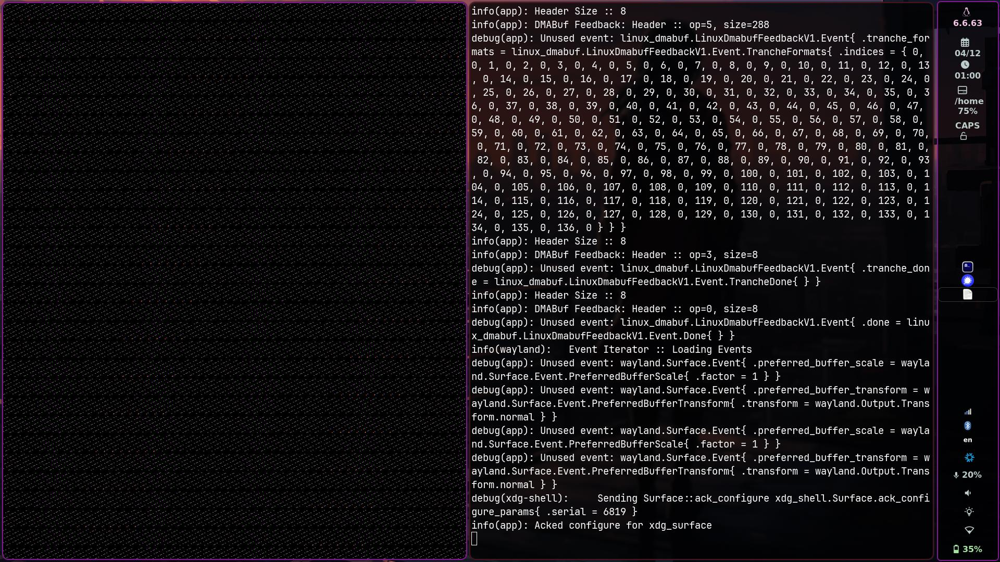
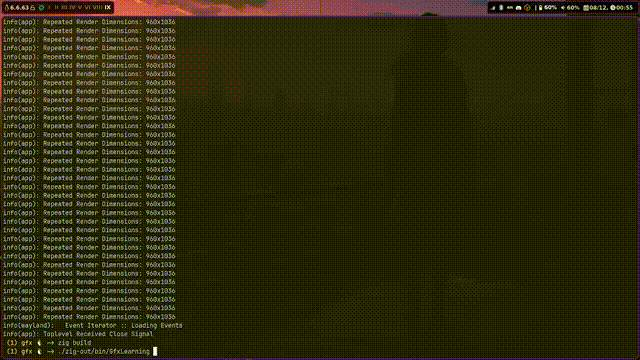

# Gfx Project

I started out writing a Wayland client with just libwayland in [C](https://github.com/Liam-Malone/wayland_gfx) and wanted to [duplicate in Zig](https://github.com/Liam-Malone/zig-wayland_gfx). I got curious and decided I'd like to try invoking calls through the wayland socket directly, no libwayland.
I found [this guide](https://gaultier.github.io/blog/wayland_xrom_scratch.html) on writing a (CPU-rendered) Wayland GUI client from scratch in C, and decided to try following along in Zig.

One I had the client working with a CPU-rendered window, I figured I could take this further, and start doing GPU rendering.
The next step was creating a basic Vulkan context and rendering a blank screen, taking advantage of the DMABuf protocol.

Now I'm looking to continue developing this project into more of a proper rendering engine, as I learn more about graphics programming with Vulkan.

## Code Generation

In the process of attaining a basic window, I realized it would be much easier if I didn't have to manually write everything for every interface I want to use. With this goal in mind, I wrote [`wl-zig-bindgen.zig`](./src/wl-zig-bindgen.zig) to produce Zig code to use for interacting with the Wayland server, given a wayland xml specification document.

## Goals

- [x] Basic Window
- [x] Vulkan Context
- [-] Input Event Handling
- [ ] Hello Triangle
- [ ] Texture/Image Rendering
- [ ] 3D Graphics Rendering

#### Next Steps

- [x] Re-structure wayland interface
- [x] Move wayland-specific client handling to it's own file
- [-] Keyboard/Mouse input events
- [ ] Proper vulkan swapchain creation pipeline
- [ ] Window resizing

### Potential Future Goals

- [ ] Abstract Windowing/Input Handling to Standalone Library
- [ ] Cross Platform Support (Mac/Windows)
- [ ] Game (/Engine) Based on This Project

### Milestones Hit:

- 01:00am - 04/12/2024: First Vulkan Rendered Window

- 01:00am - 08/12/2024: Fixed Coloring For a Proper Background Clearing

